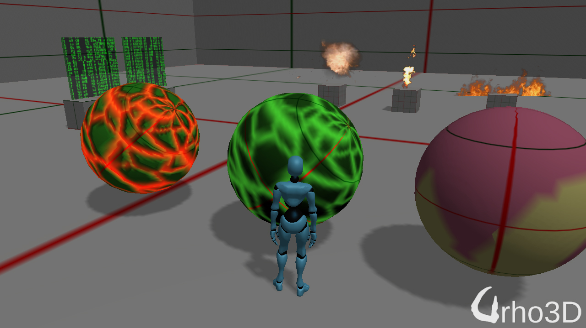
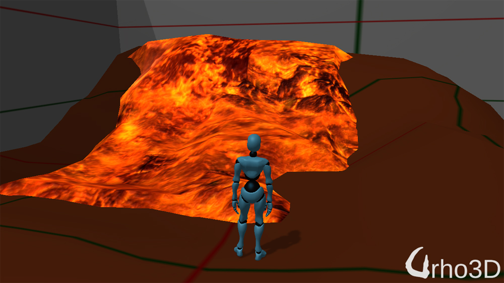
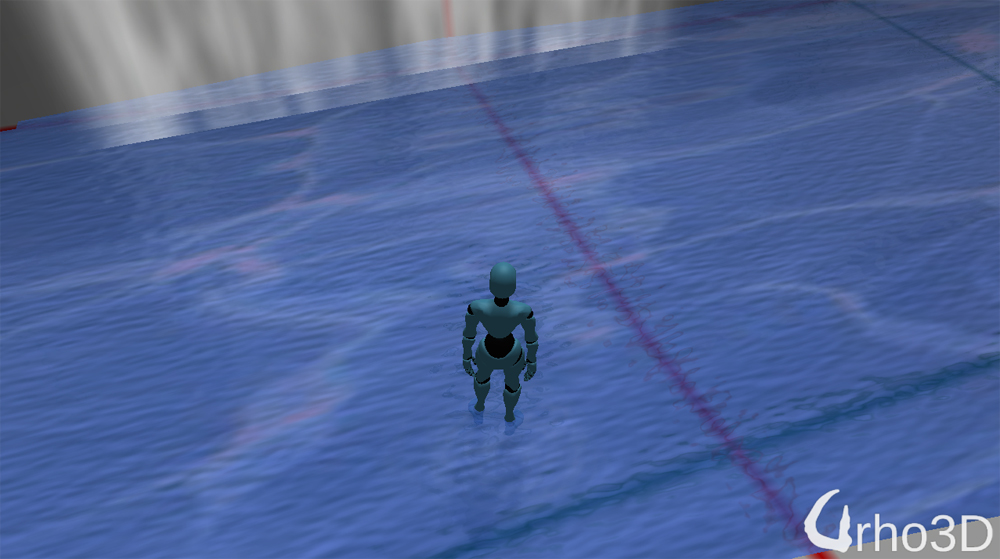
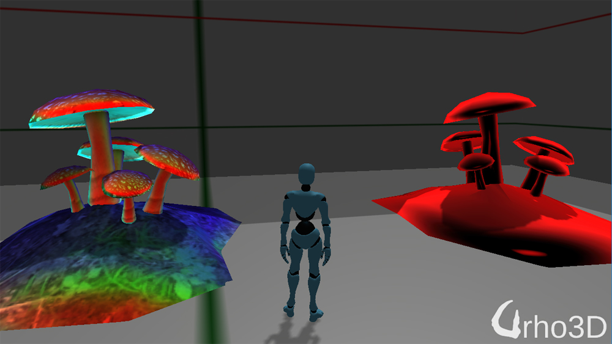
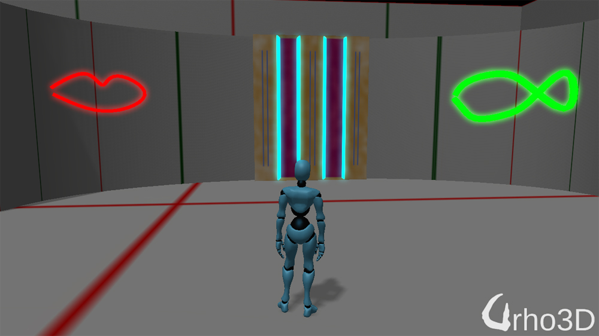

#Material Effects
-----------------------------------------------------------------------------------

Description
-----------------------------------------------------------------------------------
C# implementation of the original C++ implementation that was done by Lumak https://github.com/Lumak/Urho3D-Material-Effects.\
Basic material and techniques used for rendering effects, it might be useful for individuals new to Urho3D.
In addition, added new water shader, fake BRDF, and post-processing glow per object per mask. 

Screenshots
-----------------------------------------------------------------------------------

Thanks
-----------------------------------------------------------------------------------
To codingmonkey for his post on screen space blur on the Urho3D forum and the leg work he had done.

License
-----------------------------------------------------------------------------------
The MIT License (MIT)

