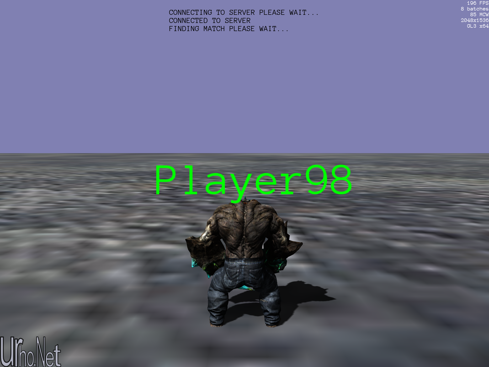

### Description
-----------------------------------------------------------
This is a showcase of a Client-Server implementation utilizing the [Nakama](https://heroiclabs.com) open-source commercial game server.\
The client side integrates the compiled DotNet reference of the [Nakama-Dotnet client](https://github.com/heroiclabs/nakama-dotnet).\
This demo-client runs on all [Urho.Net](https://github.com/Urho-Net/Urho.Net) supported platforms (Windows,MacOs,Linux,iOS,Android)\
To run this demo you will have to install the Nakama server first .\
Some Youtube video's on how todo it.\
[Installing Docker Desktop](https://www.youtube.com/watch?v=LJNe4j1DqEI)\
[Running the Nakama Server Using Docker](https://www.youtube.com/watch?v=P6kXtkwcCOE)\
Once The server is up and running you can compile and run this demo as any other [Urho.Net](https://github.com/Urho-Net/Urho.Net) project .\
Once the application starts , you will have to choose the number of playersvand type the server IP.\
You can find the Server IP by typing ifconfig or ipconfig on the Host machine that is running the server.\
Press connect on all client devices and wait for the devices to connect and match with the other devices , enjoy !!

[Android APK Link](https://drive.google.com/file/d/1VWnz3ueEOnJd2XJJ7kmbyU5q6OXgM3em/view?usp=sharing)

-----------------------------------------------------------

License
-----------------------------------------------------------------------------------
The MIT License (MIT)

